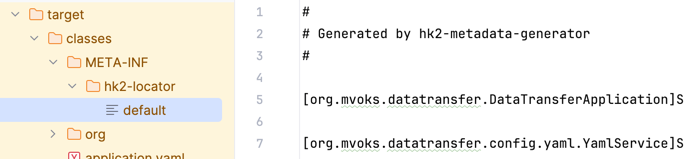

# Read Me First
#### To build the project correctly, you need to follow these steps:

    mvm clear
    mvn install
    In IDEA press "Build/Rebuild Project"
    mvn install

Check file: <b>target/classes/META-INF/hk2-localor/default</b> 
There should be something similar to this:

